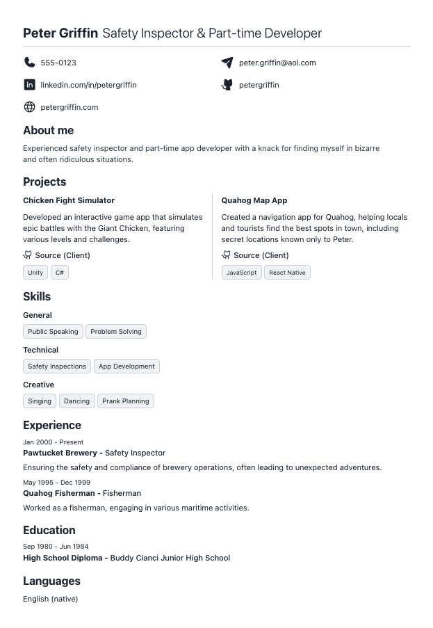

# Clean Resume

This is a straightforward Preact-based web application designed to create a personal resume. Simply edit a JSON file and then print or save it as a PDF.



## Getting Started

### Clone the repository to your local machine:

```git
git clone https://github.com/nick-vi/clean-resume.git
cd clean-resume
```

Run the following command in the project root directory to install the required dependencies

```
npm install
```

### Edit Your Resume Data

Rename data.json.example to data.json file in the project root with your personal information, work experience, projects, etc.

> Note: Only the first two projects will be displayed in the projects section, so adding more than two is unnecessary.

```json
{
  "fullName": "",
  "title": "",
  "phoneNumber": "",
  "email": "",
  "linkedin": "",
  "website": "",
  "github": "",
  "aboutMe": "",
  "projects": [
    {
      "name": "",
      "description": "",
      "techStack": [],
      "live": "",
      "source": [
        {
          "type": "client",
          "url": ""
        },
        {
          "type": "backend",
          "url": ""
        }
      ]
    },
    {
      "name": "",
      "description": "",
      "techStack": [],
      "live": "",
      "source": [
        {
          "type": "mono",
          "url": ""
        }
      ]
    }
  ],
  "experience": [
    {
      "title": "",
      "company": "",
      "location": "",
      "dates": "",
      "description": ""
    }
  ],
  "skills": "",
  "education": [
    {
      "degree": "",
      "school": "",
      "dates": ""
    }
  ],
  "languages": [
    {
      "language": "",
      "proficiency": ""
    }
  ]
}
```

### Run the Development Server

```
npm run dev
```

### Print Your Resume

Once your resume looks good in the browser, you can print it directly from the browser for a physical copy or save it as a PDF.
